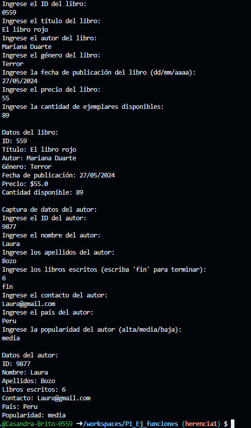

crear la clase Mascota con los atributos( id_mascota, nombre y raza) con una función capturadatos(), con interacción de interfaz de usuario. crear la clase DatosMascota con herencia Mascota y una función mostrardatos(). lenguaje dart

salida de datos:

