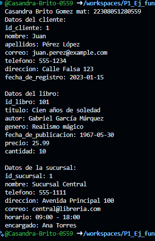

crear map diferentes <string, dinamic> 
clientes con los siguentes: key, id_cliente, nombre, apellidos, correo, telefono, direccion, fecha_de_registro. 
libros con lo siguiente: key, id_libro, titulo, autor, genero, fecha_de_publicacion, precio, cantidad.
sucursales con lo siguiente: id_sucursal, nombre, telefono, direccion, correo, horario, encargado. 
y mostrar los datos con un for each. lenguaje dart

salida de datos:

